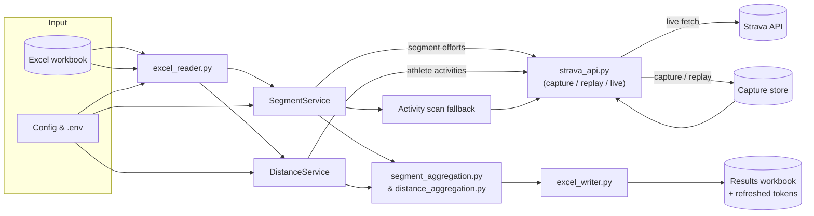

# Strava Segment & Distance Competition Tool

This app reads an Excel workbook, fetches fresh Strava data, and writes a results workbook ready to share. It is aimed at club admins who want accurate segment leaderboards and distance summaries without touching the Strava UI.

You get:

- Per-segment leaderboards with attempts, fastest time, and team rankings
- Distance competition sheets covering each window and an overall summary
- Automatic refresh-token updates so the input workbook always stays current
- An activity-scan fallback that uses Strava's `include_all_efforts` payloads for runners without leaderboard access

---

## What it does

- Reads segment, runner, and optional distance data from a structured Excel workbook
- Pulls segment efforts with pagination, retries, and adaptive rate limiting
- Fetches each distance runner’s activities once and reuses them across windows
- Writes segment sheets, team/distance summaries, and persists refreshed tokens back to the workbook

Optional sheets such as team summaries or distance summaries appear only when the source data is present. Blank team cells in the input automatically exclude a runner from that competition.

### Architecture at a glance

The diagram below shows the workbook-to-results path shared by segment and distance flows.



---

## Requirements

- Python 3.10 or later (tested on 3.13)
- A Strava API application (Client ID and Client Secret)
- Strava subscriptions for any athletes whose segment efforts you need to view (Strava enforces this)

Install the dependencies from `requirements.txt` inside a virtual environment. Example (macOS/Linux):

```bash
python3 -m venv .venv
source .venv/bin/activate
pip install -U pip -r requirements.txt
```

On Windows, use `py -3 -m venv .venv` and `.venv\Scripts\activate` instead of `source`.

---

## Configure the app

Edit `strava_competition/config.py` to point at your input and output files and to set Strava credentials:

```python
INPUT_FILE = "/absolute/path/to/competition_input.xlsx"
OUTPUT_FILE = "/absolute/path/for/output/competition_results"
OUTPUT_FILE_TIMESTAMP_ENABLED = True  # adds _YYYYMMDD_HHMMSS

import os
CLIENT_ID = os.getenv("STRAVA_CLIENT_ID", "")
CLIENT_SECRET = os.getenv("STRAVA_CLIENT_SECRET", "")
```

Performance tuning values such as worker counts, HTTP pool sizes, rate-limit settings, and retry strategy also live in this file. Adjust them only if you know you need to.

Create a `.env` file in the project root so credentials stay out of source control:

```dotenv
STRAVA_CLIENT_ID=<your_id>
STRAVA_CLIENT_SECRET=<your_secret>
USE_ACTIVITY_SCAN_FALLBACK=false
ACTIVITY_SCAN_MAX_ACTIVITY_PAGES=10
ACTIVITY_SCAN_CAPTURE_INCLUDE_ALL_EFFORTS=true
STRAVA_API_CAPTURE_ENABLED=false
STRAVA_CAPTURE_HASH_IDENTIFIERS=true
STRAVA_CAPTURE_ID_SALT=please_change_me
STRAVA_CAPTURE_REDACT_PII=true
STRAVA_CAPTURE_REDACT_FIELDS=name,email,athlete.firstname,athlete.lastname
```

The app loads `.env` automatically when it starts.

#### Replay-tail refresh knobs

When `STRAVA_API_REPLAY_ENABLED` is on, the tool automatically tops up cached
`/athlete/activities` pages with live data. You can tune the behaviour via
environment variables:

| Variable                   | Default | Description                                                                                                                     |
| -------------------------- | ------- | ------------------------------------------------------------------------------------------------------------------------------- |
| `REPLAY_CACHE_TTL_DAYS`    | `7`     | Maximum age for cached pages before they are discarded and fully refetched. Set to `0` to disable the TTL.                      |
| `REPLAY_MAX_LOOKBACK_DAYS` | `30`    | Guard that prevents replaying extremely old captures. When exceeded, the process logs a warning and performs a full live fetch. |
| `REPLAY_EPSILON_SECONDS`   | `60`    | Small overlap injected into the tail window so activities near the cached boundary are never skipped.                           |
| `REPLAY_MAX_PARALLELISM`   | `4`     | Caps how many runners are refreshed in parallel inside the distance service orchestration layer.                                |

The hybrid replay-tail workflow automatically persists enriched pages back to
the capture directory. When `STRAVA_API_CAPTURE_OVERWRITE` is `False` (the
default), enriched data is stored in lightweight overlay files so existing
captures remain untouched.

#### Capture hygiene & retention

- **Hash runner identifiers** via `STRAVA_CAPTURE_HASH_IDENTIFIERS=true` and set a
  unique `STRAVA_CAPTURE_ID_SALT` so capture filenames do not leak Strava IDs.
- **Redact payload fields** (names, emails, GPS metadata, etc.) by enabling
  `STRAVA_CAPTURE_REDACT_PII` and listing comma-separated JSON paths in
  `STRAVA_CAPTURE_REDACT_FIELDS`.
- **Prune stale captures** with the helper documented in the [CLI tools](#cli-tools)
  section to keep disk usage predictable.
- **Automate retention** via `STRAVA_CAPTURE_AUTO_PRUNE_DAYS=30` (or any
  positive integer) to delete aged capture files when the app starts. Set to `0`
  to disable automatic pruning.

### Workbook layout

All sheet names are case sensitive.

- `Segment Series`: segment ID, segment name, start date, end date, default time
- `Runners`: name, Strava ID, refresh token, segment team, distance team
- Optional `Distance Series`: start date, end date, distance threshold (km)

Leave a team column blank to skip that runner for the related competition. Dates can be Excel dates or ISO strings; pandas handles both.

`Default Time` accepts `HH:MM:SS`, Excel time values, or raw seconds. Every runner without a recorded effort for a segment is assigned this fallback so rankings and summaries always include every participant.

---

## Getting refresh tokens

The first time you add a runner you need a refresh token. Run the helper:

```bash
python -m strava_competition.oauth
```

It spins up a small web server, opens Strava’s OAuth screen, and logs masked token metadata once the runner approves. Pass `--print-tokens` if you explicitly need the plaintext values. Copy the refresh token into the `Runners` sheet. You can change `OAUTH_PORT` inside `oauth.py` if needed.

Already have an authorisation code? Swap it via curl:

```bash
curl -X POST https://www.strava.com/oauth/token \
  -d client_id=<your_client_id> \
  -d client_secret=<your_client_secret> \
  -d code=<authorisation_code> \
  -d grant_type=authorization_code
```

The response includes the refresh token. Store it securely.

---

## CLI tools

Two small helpers live under `strava_competition/tools` and share the same
configuration as the main app:

- `fetch_runner_segment_efforts`: dumps `/athlete/activities` windows with
  `include_all_efforts=true` so you can inspect raw Strava payloads for a
  runner. Use `python -m strava_competition.tools.fetch_runner_segment_efforts --help`
  for the argument list.
- `deviation_map`: builds an interactive Folium map that highlights gate
  crossings and large deviations for a runner/segment pair. Launch it via
  `python -m strava_competition.tools.deviation_map --help` and point the
  output wherever you need.
- `capture_gc`: deletes capture responses older than a retention window. Run
  `python -m strava_competition.tools.capture_gc --max-age 30d` to prune files
  older than 30 days (supports `d`, `h`, or raw seconds).

The legacy `helper/fetch_runner_segment_efforts.py` shim now imports these
modules so existing scripts keep working.

---

## Run it

Activate your virtual environment, then run either command from the repo root:

```bash
python -m strava_competition
# or
python run.py
```

The app reads the workbook, fetches the required Strava data, writes the results workbook named after `OUTPUT_FILE`, and updates the runner tokens inline. Status logs print to stdout with minimal secrets.

---

## How it works

### Data flow

- `excel_reader.py` loads the workbook and validates each sheet
- `services/segment_service.py` and `services/distance_service.py` orchestrate Strava API calls via `strava_api.py`
- Results flow through `segment_aggregation.py`, `distance_aggregation.py`, and finally `excel_writer.py`
- Updated refresh tokens are written back before shutdown

### Activity scan fallback

Some runners only expose full Strava activities. Set `USE_ACTIVITY_SCAN_FALLBACK=true`
to rebuild results from `include_all_efforts` payloads. The scanner fetches each
activity window once, reuses cached pages, and logs the inspected activity IDs
for auditing.

**Playbook:**

1. Enable `USE_ACTIVITY_SCAN_FALLBACK` (and keep `FORCE_ACTIVITY_SCAN_FALLBACK=false`
   so paid athletes still use official efforts). Optionally limit pagination via
   `ACTIVITY_SCAN_MAX_ACTIVITY_PAGES`.
2. Prime captures with `STRAVA_API_CAPTURE_ENABLED=true` / `STRAVA_API_REPLAY_ENABLED=false`.
3. Switch to deterministic runs using replay (and `STRAVA_OFFLINE_MODE=true` if you
   want to ban live calls). Watch for `source=activity_scan` in the logs.

Keep `ACTIVITY_SCAN_CAPTURE_INCLUDE_ALL_EFFORTS=true` so cached payloads match the
scanner. Missing captures in offline mode raise `StravaAPIError`. Files live under
`strava_api_capture/`; the `tests/strava_api_capture/` folder holds the fixtures
used by pytest.

---

## Troubleshooting

- 401 when refreshing tokens: the refresh token or client credentials are wrong; rerun the OAuth helper
- 402 Payment Required: the athlete needs a paid Strava subscription for segment efforts
- 429 Too Many Requests: wait for the rate limit window; the app already backs off
- Excel opens without visible sheets: the app writes placeholder sheets when a segment has no data
- Port 5000 in use for OAuth: change `OAUTH_PORT` or free the port (AirPlay often uses it on macOS)

---

## Tests

```bash
pytest -q
```

Run tests from the repo root so `tests/conftest.py` loads correctly. Key files include `test_excel_summary.py`, `test_rate_limiter.py`, `test_auth.py`, `test_integration_api_auth.py`, and `test_strava_api_mocked.py`.

---

## Development tips

- Work in a virtual environment and keep secrets out of source control
- Use `python -m strava_competition.oauth` for new tokens
- Use `python -m strava_competition` for production runs
- Adjust configuration values via environment variables rather than editing code when possible
