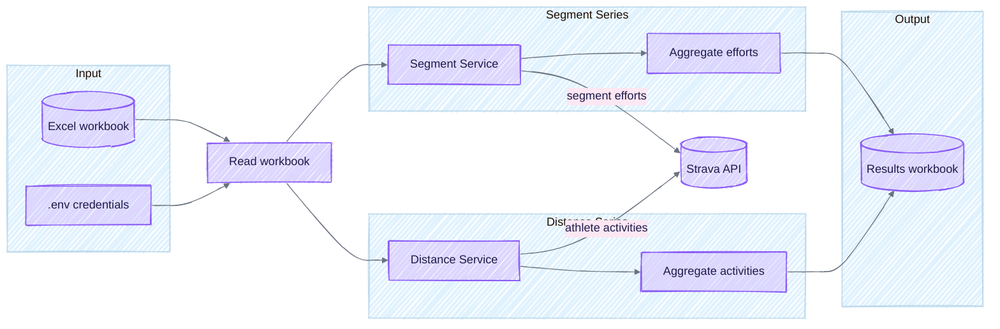

# Strava Segment & Distance Competition Tool

A command-line tool that reads an Excel workbook, fetches Strava data, and produces a results workbook ready to share. Built for running club admins who want accurate segment leaderboards and distance summaries without living inside the Strava UI.

## Contents

- [Features](#features)
  - [Segment Series](#segment-series)
  - [Distance Series](#distance-series)
- [Workbook Layout](#workbook-layout)
- [CLI Tools](#cli-tools)
- [Setup & Running](#setup--running)
  - [Requirements](#requirements)
  - [Installation](#installation)
  - [Configuration](#configuration)
  - [Running the App](#running-the-app)
  - [Docker](#docker)
- [How It Works](#how-it-works)
- [Getting Refresh Tokens](#getting-refresh-tokens)
- [Troubleshooting](#troubleshooting)
- [Development](#development)

---

## Features

### Segment Series

Track who's fastest on your club's favourite Strava segments. For each segment you define, the app fetches every runner's efforts within the date window and ranks them by time.

The output includes one sheet per segment showing:

- Runner name and team
- Elapsed time (with any bonuses applied)
- Number of attempts
- Whether a birthday bonus was applied

#### Split Windows

Run one segment across multiple date windows and show each runner's best effort across all windows.

**When to use:**

- **Multi-week competitions** – e.g. "Hill Climb Challenge" running for 6 weeks
- **Seasonal events** – compare best times across spring, summer, and autumn
- **Promotional periods** – give runners multiple chances to post their best time

Add multiple rows with the same Segment ID. Each row becomes a separate window, and the runner's fastest time across all windows appears in the output.

| Segment ID | Segment Name      | Start Date | End Date   | Window Label |
| ---------- | ----------------- | ---------- | ---------- | ------------ |
| 12345678   | Hill Climb Sprint | 2026-01-01 | 2026-01-15 | Week 1       |
| 12345678   | Hill Climb Sprint | 2026-01-16 | 2026-01-31 | Week 2       |
| 12345678   | Hill Climb Sprint | 2026-02-01 | 2026-02-14 | Final Push   |

#### Birthday Bonus

Give runners a time advantage on their birthday. If a runner completes a segment effort on their birthday, the configured bonus is deducted from their elapsed time.

1. In the `Runners` sheet, add each runner's birthday in `dd-MMM` format (e.g. `15-Jan`)
2. In the `Segment Series` sheet, set `Birthday Bonus (secs)` to the seconds to deduct

**Example:** Alice's birthday is `15-Jan`. She completes the segment in 120 seconds on 15th January with a 30-second bonus configured—her adjusted time becomes **90 seconds**.

#### Time Bonus

Apply a time adjustment to **all runners** who complete an effort within a specific window. Unlike birthday bonus, this applies to everyone.

- **Positive values** subtract time (reward/bonus)
- **Negative values** add time (penalty)

Use cases: 30-second bonus for running on Christmas Day, or a penalty for adverse weather conditions.

#### Minimum Distance Filter

Filter out short efforts that don't cover the full segment. Useful when Strava records partial efforts due to GPS issues.

Set `Minimum Distance (m)` in the Segment Series sheet. Only efforts meeting that threshold count.

#### Default Time

Assign a fallback time for runners who don't complete the segment. Ensures rankings always account for the full roster.

Set `Default Time` as `HH:MM:SS`, Excel time values, or raw seconds.

---

### Distance Series

Track cumulative running distance over time windows. This is separate from segment competitions and doesn't require specific Strava segments.

1. Define date windows in the `Distance Series` sheet
2. The app fetches each runner's activities within the window
3. Distances from qualifying activity types (runs by default) are totalled
4. Results show per-runner and per-team totals

**Distance Threshold** is optional—only runners who meet or exceed this distance appear in results.

---

## Workbook Layout

Your input workbook needs the following sheets (names are case-sensitive):

### Runners

| Column               | Description                                             |
| -------------------- | ------------------------------------------------------- |
| Name                 | Display name for the runner                             |
| Strava ID            | The athlete's Strava ID                                 |
| Refresh Token        | OAuth refresh token (see below)                         |
| Segment Series Team  | Team name for segment competitions (optional)           |
| Distance Series Team | Team name for distance competitions (optional)          |
| Birthday (dd-MMM)    | Runner's birthday for bonus calculations, e.g. `07-May` |

Leave a team column blank and that runner skips the related competition.

### Segment Series

| Column                | Description                                           |
| --------------------- | ----------------------------------------------------- |
| Segment ID            | Strava segment ID                                     |
| Segment Name          | Display name                                          |
| Start Date            | Window start (Excel date or ISO string)               |
| End Date              | Window end                                            |
| Window Label          | Optional label for split windows (e.g. "Week 1")      |
| Default Time          | Fallback time for runners with no effort (`HH:MM:SS`) |
| Minimum Distance (m)  | Minimum effort distance to qualify (optional)         |
| Birthday Bonus (secs) | Seconds deducted for birthday efforts                 |
| Time Bonus (secs)     | Seconds added/subtracted for all runners in window    |

### Distance Series (optional)

| Column                  | Description                            |
| ----------------------- | -------------------------------------- |
| Start Date              | Window start                           |
| End Date                | Window end                             |
| Distance Threshold (km) | Minimum distance to qualify (optional) |

---

## CLI Tools

Helper scripts live under `strava_competition/tools/`:

| Tool                           | Description                                                    |
| ------------------------------ | -------------------------------------------------------------- |
| `fetch_runner_segment_efforts` | Dump `/athlete/activities` windows with `include_all_efforts`  |
| `fetch_activity_gps`           | Fetch GPS coordinates for an activity as GPX                   |
| `fetch_segment_gpx`            | Export a Strava segment as a GPX route file                    |
| `clip_activity_segment`        | Slice track points from a GPX file for a segment effort        |
| `deviation_map`                | Build an interactive map showing gate crossings and deviations |
| `capture_gc`                   | Delete cache responses older than a retention window           |

Run any tool with `--help` for usage:

```bash
python -m strava_competition.tools.fetch_activity_gps --help
```

---

## Setup & Running

### Requirements

- Python 3.10 or later
- A Strava API application ([create one here](https://www.strava.com/settings/api))
- Strava subscriptions for athletes whose segment efforts you need (Strava enforces this)

### Installation

```bash
python3 -m venv .venv
source .venv/bin/activate
pip install -U pip -r requirements.txt
```

On Windows use `.venv\Scripts\activate` instead of `source`.

### Configuration

Create a `.env` file in the project root:

```dotenv
STRAVA_CLIENT_ID=<your_client_id>
STRAVA_CLIENT_SECRET=<your_client_secret>
```

By default the app reads from `data/competition_input.xlsx` and writes results to `data/competition_results_<timestamp>.xlsx`. Override these on the command line:

```bash
python -m strava_competition --input path/to/input.xlsx --output path/to/results
```

### Running the App

```bash
# Activate your virtual environment
source .venv/bin/activate

# Run with defaults
python -m strava_competition

# Or specify paths
python -m strava_competition -i input.xlsx -o results
```

### Docker

```bash
docker build -t strava-competition .
```

#### macOS / Linux

```bash
docker run --rm -v "$(pwd)":/app -w /app strava-competition
```

#### Windows (PowerShell)

```powershell
docker run --rm `
  -v "${PWD}:/app" `
  -w /app `
  strava-competition
```

#### Windows (Command Prompt)

```cmd
docker run --rm ^
  -v %CD%:/app ^
  -w /app ^
  strava-competition
```

> **Tip:** Make sure Docker Desktop can see the drive you're mounting (Settings → Resources → File Sharing on Windows).

---

## How It Works



1. **Read** – Loads segments, runners, and optional distance windows from your Excel workbook
2. **Fetch** – Pulls segment efforts and activities from the Strava API
3. **Aggregate** – Calculates rankings, applies bonuses, and builds team summaries
4. **Write** – Produces a results workbook with one sheet per segment plus summary sheets

Updated refresh tokens are written back to the workbook before the app exits.

---

## Getting Refresh Tokens

Each runner needs a Strava refresh token. Run the OAuth helper:

```bash
python -m strava_competition.oauth
```

This opens Strava's authorisation screen. Once the runner approves, copy the refresh token into the workbook.

---

## Troubleshooting

| Error                    | Solution                                                        |
| ------------------------ | --------------------------------------------------------------- |
| 401 Unauthorised         | Refresh token or credentials are wrong—rerun the OAuth helper   |
| 402 Payment Required     | The athlete needs a paid Strava subscription for segment data   |
| 429 Too Many Requests    | Wait for the rate-limit window; the app backs off automatically |
| Port 5000 in use (OAuth) | Change `OAUTH_PORT` in `oauth.py` or free the port              |

---

## Development

### Running Tests

```bash
pytest -q
```

### Quality Checks

```bash
ruff check
mypy
bandit -q -r strava_competition
pytest
```

### Tips

- Keep secrets out of source control—use `.env`
- Use `python -m strava_competition.oauth` for fresh tokens
- Prefer environment variables over code edits for configuration
