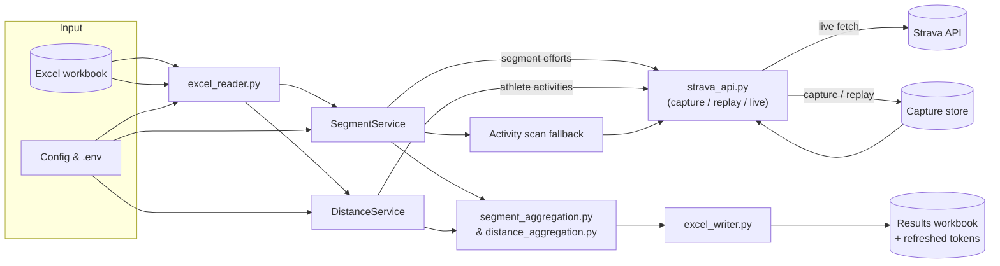

# Strava Segment & Distance Competition Tool

This app reads an Excel workbook, fetches fresh Strava data, and writes a results workbook ready to share. It's built for club admins who want accurate segment leaderboards and distance summaries without living inside the Strava UI.

You get:

- Per-segment leaderboards showing attempts, fastest times, and team rankings
- Distance competition sheets for every window plus an overall summary
- Automatic refresh-token updates so the input workbook always stays current
- An activity-scan fallback that taps Strava's `include_all_efforts` payloads for runners without leaderboard access

---

## What it does

- Reads segment, runner, and optional distance data from a structured Excel workbook
- Pulls segment efforts with pagination, retries, and adaptive rate limiting
- Fetches each distance runner’s activities once and reuses them across windows
- Writes segment sheets, team/distance summaries, and persists refreshed tokens back to the workbook

Optional sheets like team or distance summaries only appear when you feed in the right data. Leave a team cell blank and that runner simply sits out that competition.

### Architecture at a glance

Here’s the workbook-to-results path that both the segment and distance flows follow.



---

## Requirements

- Python 3.10 or later (tested on 3.13)
- A Strava API application (Client ID and Client Secret)
- Strava subscriptions for any athletes whose segment efforts you need to view (Strava enforces this)

Install the dependencies from `requirements.txt` inside a virtual environment. On macOS or Linux:

```bash
python3 -m venv .venv
source .venv/bin/activate
pip install -U pip -r requirements.txt
```

On Windows use `py -3 -m venv .venv` and `.venv\Scripts\activate` instead of `source`.

---

## Configure the app

The app looks for input/output files in the `data/` folder by default. You can override
paths via command-line arguments (see [Run it](#run-it)) or by editing the defaults in
`strava_competition/config.py`:

```python
INPUT_FILE = "data/competition_input.xlsx"
OUTPUT_FILE = "data/competition_results"
OUTPUT_FILE_TIMESTAMP_ENABLED = True  # adds _YYYYMMDD_HHMMSS
```

Quick reference for the default on-disk layout inside `data/`:

- Input workbook: `data/competition_input.xlsx` (drop your Excel file here unless
  you override paths on the CLI).
- Results: `data/competition_results_<timestamp>.xlsx` when timestamping is on,
  or `data/competition_results.xlsx` when you disable it.
- GPX helpers: `data/gpx_output/` (auto-created by the CLI tools so exports live
  alongside other generated artifacts).

Performance tuning knobs—worker counts, HTTP pools, rate limits, retry strategy, and so on—also live in this file. Tweak them only when you have a concrete reason.

Create a `.env` file in the project root so credentials stay out of source control:

```dotenv
STRAVA_CLIENT_ID=<your_id>
STRAVA_CLIENT_SECRET=<your_secret>
USE_ACTIVITY_SCAN_FALLBACK=true
ACTIVITY_SCAN_MAX_ACTIVITY_PAGES=0
ACTIVITY_SCAN_CAPTURE_INCLUDE_ALL_EFFORTS=true
STRAVA_API_CAPTURE_ENABLED=true
STRAVA_CAPTURE_HASH_IDENTIFIERS=true
STRAVA_CAPTURE_ID_SALT=please_change_me
STRAVA_CAPTURE_REDACT_PII=true
STRAVA_CAPTURE_REDACT_FIELDS=name,email,athlete.firstname,athlete.lastname
```

The app pulls in `.env` automatically at startup.

#### Replay-tail refresh knobs

When `STRAVA_API_REPLAY_ENABLED` is on, the tool automatically tops up cached
`/athlete/activities` pages with live data. You can tune the behaviour via
environment variables:

| Variable                   | Default | Description                                                                                                                     |
| -------------------------- | ------- | ------------------------------------------------------------------------------------------------------------------------------- |
| `REPLAY_CACHE_TTL_DAYS`    | `7`     | Maximum age for cached pages before they are discarded and fully refetched. Set to `0` to disable the TTL.                      |
| `REPLAY_MAX_LOOKBACK_DAYS` | `30`    | Guard that prevents replaying extremely old captures. When exceeded, the process logs a warning and performs a full live fetch. |
| `REPLAY_EPSILON_SECONDS`   | `60`    | Small overlap injected into the tail window so activities near the cached boundary are never skipped.                           |
| `REPLAY_MAX_PARALLELISM`   | `4`     | Caps how many runners are refreshed in parallel inside the distance service orchestration layer.                                |

The hybrid replay-tail workflow automatically persists enriched pages back to
the capture directory. When `STRAVA_API_CAPTURE_OVERWRITE` is `False` (the
default), enriched data is stored in lightweight overlay files so existing
captures remain untouched.

#### Capture hygiene & retention

- **Hash runner identifiers.** Turn on `STRAVA_CAPTURE_HASH_IDENTIFIERS=true` and give it a
  unique, non-empty `STRAVA_CAPTURE_ID_SALT` so capture filenames don't leak Strava IDs.
  When hashing is enabled without a salt the app simply bows out instead of producing
  predictable hashes.
- **Redact payload fields.** Enable `STRAVA_CAPTURE_REDACT_PII` and list comma-separated
  JSON paths in `STRAVA_CAPTURE_REDACT_FIELDS` to strip names, emails, GPS details, and any
  other sensitive bits before writing to disk.
- **Prune stale captures.** Use the helper in the [CLI tools](#cli-tools) section whenever
  you want to free disk space without touching fresh data.
- **Automate retention.** Set `STRAVA_CAPTURE_AUTO_PRUNE_DAYS=30` (or whatever window you
  prefer) to delete old capture files on startup. Pick `0` to leave files alone.

#### Security considerations for token capture

⚠️ **Heads-up:** Token capture stays off by default for good reason.

The `STRAVA_TOKEN_CAPTURE_ENABLED` flag decides whether OAuth token responses hit disk.
Those payloads include:

- Access tokens (short-lived but grants full API access)
- Refresh tokens (long-lived credentials that can generate new access tokens)
- Athlete identifiers and profile metadata

**Only enable token capture in a controlled debugging session.** Never commit captured
token files to version control. If you flip the flag on:

1. Ensure the capture directory is excluded from git (already covered by `.gitignore`)
2. Delete captured token files immediately after debugging
3. Consider rotating affected refresh tokens via the OAuth flow
4. Never deploy with this setting enabled

### Workbook layout

All sheet names are case-sensitive; match them exactly as written below.

- `Segment Series`: Segment ID, Segment Name, Start Date, End Date, Default Time,
  Minimum Distance (m), **Birthday Bonus (secs)**
- `Runners`: Name, Strava ID, Refresh Token, Segment Series Team,
  Distance Series Team, **Birthday (dd-mmm)**
- Optional `Distance Series`: Start Date, End Date, Distance Threshold (km)

Leave a team column blank and that runner quietly skips the related competition. Runner birthdays must stay in `dd-MMM` form (e.g. `07-May`). The reader accepts Excel dates or ISO strings, but when the workbook is rewritten the values are normalised to that format. Other date columns can be Excel dates or ISO strings—pandas is happy with either.

`Default Time` accepts `HH:MM:SS`, Excel time values, or raw seconds. Every runner with no recorded effort picks up this fallback so rankings always account for the full roster.

`Minimum Distance (m)` is optional per segment. Leave it blank or set it to `0`
to disable distance filtering. When populated with a positive value the runner's
effort distance (from Strava's payload) must meet or exceed that threshold to
count toward rankings.

---

## Getting refresh tokens

The first time you add a runner you’ll need a refresh token. Run the helper:

```bash
python -m strava_competition.oauth
```

It spins up a tiny web server, opens Strava’s OAuth screen, and logs masked token metadata once the runner approves. Pass `--print-tokens` if you need the plaintext values. Copy the refresh token into the `Runners` sheet. Change `OAUTH_PORT` inside `oauth.py` if you need a different port.

Already have an authorisation code? Trade it for tokens with curl:

```bash
curl -X POST https://www.strava.com/oauth/token \
  -d client_id=<your_client_id> \
  -d client_secret=<your_client_secret> \
  -d code=<authorisation_code> \
  -d grant_type=authorization_code
```

The response includes the refresh token—stash it somewhere safe.

---

## CLI tools

You’ll find the helper scripts under `strava_competition/tools`, and they pull from the
same configuration as the main app:

- `fetch_runner_segment_efforts`: dumps `/athlete/activities` windows with
  `include_all_efforts=true` so you can poke through the raw Strava payloads for
  a runner. Run `python -m strava_competition.tools.fetch_runner_segment_efforts --help`
  to check the flags.
- `fetch_activity_gps`: fetches GPS coordinates for a specific activity using
  Strava's Streams API. Outputs to `data/gpx_output/activity_<id>.gpx` by default (GPX format)
  and creates the directory if it isn't there yet.
  Altitude, time, and distance data are included by default; use `--no-altitude`,
  `--no-time`, or `--no-distance` to exclude. Use `--output-file` to override the
  output path, or `--no-file` to print to stdout. Run
  `python -m strava_competition.tools.fetch_activity_gps --help` for usage.
- `fetch_segment_gpx`: exports a Strava segment as a GPX route file for sharing
  or importing into GPS devices and mapping apps. Outputs to `data/gpx_output/segment_<id>.gpx`
  by default and creates the directory automatically. Use `--output-file` to override
  the output path, or `--no-file` to print
  to stdout. Run `python -m strava_competition.tools.fetch_segment_gpx --help` for usage.
- `clip_activity_segment`: slices a window of track points out of a GPX file so you can
  reproduce a Strava segment effort locally. Start/end indices are optional—pick
  whichever selector suits you: the zero-based indices from Strava's
  `segment_efforts` API, a time window, a captured `segment_efforts` response, or
  provide the Strava IDs (activity + segment) plus a refresh token and the
  tool will fetch the GPX stream and effort metadata for you. Auto-downloaded GPX
  files land in `data/gpx_output/` by default (override with `--download-dir`),
  and `--force-download` refreshes the cache when you need a clean pull.

  Fully automatic example (no local GPX/JSON required):

  ```bash
  python -m strava_competition.tools.clip_activity_segment \
    --activity-id 16543582334 \
    --segment-id 40422214 \
    --refresh-token 428d4533373e68e32ec57e9fae2b8fc79ed934f5 \
    --runner-id 19923466 \
    --output data/gpx_output/activity_16543582334_segment_40422214_auto.gpx
  ```

  Index-based example:

  ```bash
  python -m strava_competition.tools.clip_activity_segment \
    --input data/gpx_output/activity_16919797941.gpx \
    --start-index 1572 --end-index 2699 \
    --output data/gpx_output/activity_16919797941_segment_40641291.gpx
  ```

  JSON-based auto detection:

  ```bash
  python -m strava_competition.tools.clip_activity_segment \
    --input data/gpx_output/activity_16919797941.gpx \
    --segment-efforts-json strava_api_capture/c0/bd/...overlay.json \
    --activity-id 16919797941 \
    --segment-id 40641291
  ```

  You can also slice by ISO timestamps: `--start-time 2026-01-03T06:23:44+00:00 --elapsed 1127`.

- `deviation_map`: builds an interactive Folium map that highlights gate crossings
  and large deviations for a runner/segment pair. Launch it via
  `python -m strava_competition.tools.deviation_map --help` and drop the output
  wherever you need.
- `capture_gc`: deletes capture responses older than a retention window. Run
  `python -m strava_competition.tools.capture_gc --max-age 30d` to prune files
  older than 30 days (supports `d`, `h`, or raw seconds).

The legacy `helper/fetch_runner_segment_efforts.py` shim now imports these
modules so existing scripts keep working.

---

## Run it

With your virtual environment active, run from the repo root:

```bash
python -m strava_competition
```

By default, the app reads from `data/competition_input.xlsx` and writes results to
`data/competition_results_<timestamp>.xlsx`. Override these paths with command-line
arguments:

```bash
# Show available options
python -m strava_competition --help

# Use custom input and output paths
python -m strava_competition \
  --input /Users/me/Documents/strava/my_competition.xlsx \
  --output /Users/me/Documents/strava/results

# Short flags work too
python -m strava_competition -i ~/Dropbox/running/input.xlsx -o ~/Dropbox/running/output
```

| Flag       | Short | Description                                                       |
| ---------- | ----- | ----------------------------------------------------------------- |
| `--input`  | `-i`  | Path to the input Excel workbook                                  |
| `--output` | `-o`  | Output file base name (timestamp and `.xlsx` added automatically) |

The app reads the workbook, pulls the Strava data it needs, writes the results workbook named after `OUTPUT_FILE`, and updates runner tokens before it exits. Status logs stream to stdout and keep the sensitive bits redacted.

### Docker usage

To run inside Docker, build the image once and mount your host files into `/app` so inputs, captures, and results stay on your main drive:

```bash
docker build -t strava-competition .
```

#### macOS / Linux run command

```bash
docker run --rm \
  -v "$(pwd)":/app \
  -w /app \
  strava-competition
```

- `$(pwd)` should point at the folder containing `competition_input.xlsx` and `strava_api_capture/`.
- Outputs such as `competition_results_*.xlsx` and refreshed captures are written straight to the host directory because of the bind mount.
- Override paths by changing the `-v host_dir:/app` portion.

#### Windows run commands

PowerShell:

```powershell
docker run --rm `
  -v "${PWD}:/app" `
  -w /app `
  strava-competition
```

Command Prompt:

```cmd
docker run --rm ^
  -v %CD%:/app ^
  -w /app ^
  strava-competition
```

Tips:

- Make sure Docker Desktop can see the drive you’re mounting (Settings ▸ Resources ▸ File Sharing on Windows).
- Quote host paths that include spaces so the shell doesn’t split them.
- The container image ships with `STRAVA_API_CAPTURE_ENABLED=1`, so capture files will show up under the mounted directory’s `strava_api_capture/` folder.

---

## How it works

### Data flow

- `excel_reader.py` loads the workbook and validates each sheet.
- `services/segment_service.py` and `services/distance_service.py` orchestrate Strava API calls via `strava_api.py`.
- Results flow through `segment_aggregation.py`, `distance_aggregation.py`, and finally `excel_writer.py`.
- Updated refresh tokens are written back before shutdown.

### Activity scan fallback

Some runners only expose full Strava activities. Set `USE_ACTIVITY_SCAN_FALLBACK=true`
to rebuild results from `include_all_efforts` payloads. The scanner fetches each activity window once,
leans on cached pages when possible, and logs the inspected activity IDs for easy auditing.

**Playbook:**

1. Enable `USE_ACTIVITY_SCAN_FALLBACK` (and keep `FORCE_ACTIVITY_SCAN_FALLBACK=false`
   so paid athletes still use official efforts). Optionally limit pagination via
   `ACTIVITY_SCAN_MAX_ACTIVITY_PAGES` (defaults to `0`, meaning "no cap"—set a
   positive integer to stop after that many pages).
2. Prime captures with `STRAVA_API_CAPTURE_ENABLED=true` / `STRAVA_API_REPLAY_ENABLED=false`.
3. Switch to deterministic runs using replay (and flip `STRAVA_OFFLINE_MODE=true` if you
   want to forbid live calls). Watch for `source=activity_scan` in the logs.

Keep `ACTIVITY_SCAN_CAPTURE_INCLUDE_ALL_EFFORTS=true` so cached payloads match the scanner; otherwise
offline runs throw a `StravaAPIError` when captures are missing. Files live under
`strava_api_capture/`, and `tests/strava_api_capture/` holds the fixtures used by pytest.

---

## Troubleshooting

- 401 when refreshing tokens: the refresh token or client credentials are wrong—rerun the OAuth helper.
- 402 Payment Required: the athlete needs a paid Strava subscription for segment efforts.
- 429 Too Many Requests: wait for the rate-limit window; the app already backs off.
- Excel opens without visible sheets: the app writes placeholder sheets when a segment has no data.
- Port 5000 in use for OAuth: change `OAUTH_PORT` or free the port (AirPlay often uses it on macOS).

---

## Tests

```bash
pytest -q
```

Run tests from the repo root so `tests/conftest.py` wires itself up correctly. Highlights include `test_excel_summary.py`, `test_rate_limiter.py`, `test_auth.py`, `test_integration_api_auth.py`, `test_strava_api_mocked.py`, and the load/smoke suite in `tests/test_load_smoke.py` that exercises concurrency plus capture replay.

### Quality checks

Before opening a pull request, run the same tooling wired into CI:

```bash
ruff check
mypy
bandit -q -r strava_competition
pytest
python -m strava_competition.tools.capture_gc --dry-run --max-age-days 45
```

Those commands keep lint, typing, security scanning, tests, and capture-retention checks green before you ship anything.

---

## Development tips

- Work in a virtual environment and keep secrets out of source control.
- Reach for `python -m strava_competition.oauth` whenever you need fresh tokens.
- Use `python -m strava_competition` for real runs; `run.py` is just a thin wrapper.
- Prefer environment variables over code edits when you need to tweak configuration.
