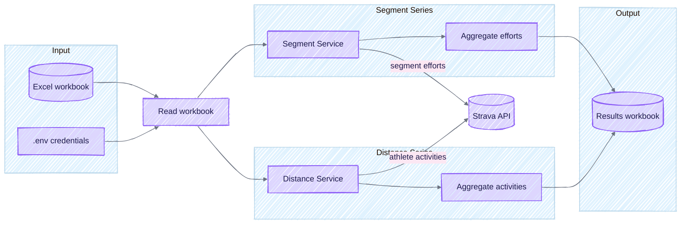

# Strava Segment & Distance Competition Tool

**[README](README.md)** · [Features Guide](FEATURES.md)

---

A command-line tool that reads an Excel workbook, fetches Strava data, and produces a results workbook ready to share. Built for running club admins who want accurate segment leaderboards and distance summaries without living inside the Strava UI.

## Features

### Segment Series

Track who's fastest on your club's favourite Strava segments.

- **Leaderboards** – Per-segment sheets with attempts, fastest times, and team rankings
- **Split windows** – Run one segment across multiple date windows; best time wins
- **Birthday bonus** – Deduct seconds from efforts on a runner's birthday
- **Time bonus** – Add or subtract seconds for all runners in a specific window

### Distance Series

Track cumulative distance over time windows.

- **Distance totals** – Sum each runner's activity distance within a date range
- **Threshold filtering** – Optionally require a minimum distance to qualify
- **Team summaries** – Aggregate totals by team

### General

- **Token auto-refresh** – OAuth tokens refreshed and written back automatically

📖 **[See the full Features Guide](FEATURES.md)** for detailed configuration options including split windows, bonuses, and thresholds.

---

## Contents

- [How it works](#how-it-works)
- [Requirements](#requirements)
- [Configuration](#configuration)
- [Workbook layout](#workbook-layout)
- [Running the app](#running-the-app)
- [CLI tools](#cli-tools)
- [Getting refresh tokens](#getting-refresh-tokens)
- [Troubleshooting](#troubleshooting)
- [Development](#development)

---

## How it works



1. **Read** – Loads segments, runners, and optional distance windows from your Excel workbook
2. **Fetch** – Pulls segment efforts and activities from the Strava API
3. **Aggregate** – Calculates rankings, applies bonuses, and builds team summaries
4. **Write** – Produces a results workbook with one sheet per segment plus summary sheets

Updated refresh tokens are written back to the workbook before the app exits.

---

## Requirements

- Python 3.10 or later
- A Strava API application ([create one here](https://www.strava.com/settings/api))
- Strava subscriptions for athletes whose segment efforts you need (Strava enforces this)

### Installation

```bash
python3 -m venv .venv
source .venv/bin/activate
pip install -U pip -r requirements.txt
```

On Windows use `.venv\Scripts\activate` instead of `source`.

---

## Configuration

### Credentials

Create a `.env` file in the project root:

```dotenv
STRAVA_CLIENT_ID=<your_client_id>
STRAVA_CLIENT_SECRET=<your_client_secret>
```

### File locations

By default the app reads from `data/competition_input.xlsx` and writes results to `data/competition_results_<timestamp>.xlsx`. Override these on the command line:

```bash
python -m strava_competition --input path/to/input.xlsx --output path/to/results
```

---

## Workbook layout

Your input workbook needs the following sheets (names are case-sensitive):

### Runners

| Column               | Description                                             |
| -------------------- | ------------------------------------------------------- |
| Name                 | Display name for the runner                             |
| Strava ID            | The athlete's Strava ID                                 |
| Refresh Token        | OAuth refresh token (see below)                         |
| Segment Series Team  | Team name for segment competitions (optional)           |
| Distance Series Team | Team name for distance competitions (optional)          |
| Birthday (dd-MMM)    | Runner's birthday for bonus calculations, e.g. `07-May` |

Leave a team column blank and that runner skips the related competition.

### Segment Series

| Column                | Description                                           |
| --------------------- | ----------------------------------------------------- |
| Segment ID            | Strava segment ID                                     |
| Segment Name          | Display name                                          |
| Start Date            | Window start (Excel date or ISO string)               |
| End Date              | Window end                                            |
| Window Label          | Optional label for split windows (e.g. "Week 1")      |
| Default Time          | Fallback time for runners with no effort (`HH:MM:SS`) |
| Minimum Distance (m)  | Minimum effort distance to qualify (optional)         |
| Birthday Bonus (secs) | Seconds deducted for birthday efforts                 |
| Time Bonus (secs)     | Seconds added/subtracted for all runners in window    |

#### Split windows

To run one segment across multiple date windows, add multiple rows with the same Segment ID. Each row becomes a separate window, and the runner's fastest time across all windows appears in the output.

#### Bonuses

- **Birthday Bonus**: Deducted when a runner completes an effort on their birthday
- **Time Bonus**: Positive values subtract time (reward), negative values add time (penalty)

### Distance Series (optional)

| Column                  | Description                            |
| ----------------------- | -------------------------------------- |
| Start Date              | Window start                           |
| End Date                | Window end                             |
| Distance Threshold (km) | Minimum distance to qualify (optional) |

The app fetches each runner's activities within the window, totals the distance, and produces a summary sheet.

---

## Running the app

```bash
# Activate your virtual environment
source .venv/bin/activate

# Run with defaults
python -m strava_competition

# Or specify paths
python -m strava_competition -i input.xlsx -o results
```

### Docker

```bash
docker build -t strava-competition .
```

#### macOS / Linux

```bash
docker run --rm -v "$(pwd)":/app -w /app strava-competition
```

#### Windows (PowerShell)

```powershell
docker run --rm `
  -v "${PWD}:/app" `
  -w /app `
  strava-competition
```

#### Windows (Command Prompt)

```cmd
docker run --rm ^
  -v %CD%:/app ^
  -w /app ^
  strava-competition
```

> **Tip:** Make sure Docker Desktop can see the drive you're mounting (Settings → Resources → File Sharing on Windows).

---

## CLI tools

Helper scripts live under `strava_competition/tools/`:

| Tool                           | Description                                                    |
| ------------------------------ | -------------------------------------------------------------- |
| `fetch_runner_segment_efforts` | Dump `/athlete/activities` windows with `include_all_efforts`  |
| `fetch_activity_gps`           | Fetch GPS coordinates for an activity as GPX                   |
| `fetch_segment_gpx`            | Export a Strava segment as a GPX route file                    |
| `clip_activity_segment`        | Slice track points from a GPX file for a segment effort        |
| `deviation_map`                | Build an interactive map showing gate crossings and deviations |
| `capture_gc`                   | Delete cache responses older than a retention window           |

Run any tool with `--help` for usage:

```bash
python -m strava_competition.tools.fetch_activity_gps --help
```

---

## Getting refresh tokens

Each runner needs a Strava refresh token. Run the OAuth helper:

```bash
python -m strava_competition.oauth
```

This opens Strava's authorisation screen. Once the runner approves, copy the refresh token into the workbook.

---

## Troubleshooting

| Error                    | Solution                                                        |
| ------------------------ | --------------------------------------------------------------- |
| 401 Unauthorised         | Refresh token or credentials are wrong—rerun the OAuth helper   |
| 402 Payment Required     | The athlete needs a paid Strava subscription for segment data   |
| 429 Too Many Requests    | Wait for the rate-limit window; the app backs off automatically |
| Port 5000 in use (OAuth) | Change `OAUTH_PORT` in `oauth.py` or free the port              |

---

## Development

### Running tests

```bash
pytest -q
```

### Quality checks

```bash
ruff check
mypy
bandit -q -r strava_competition
pytest
```

### Tips

- Keep secrets out of source control—use `.env`
- Use `python -m strava_competition.oauth` for fresh tokens
- Prefer environment variables over code edits for configuration
